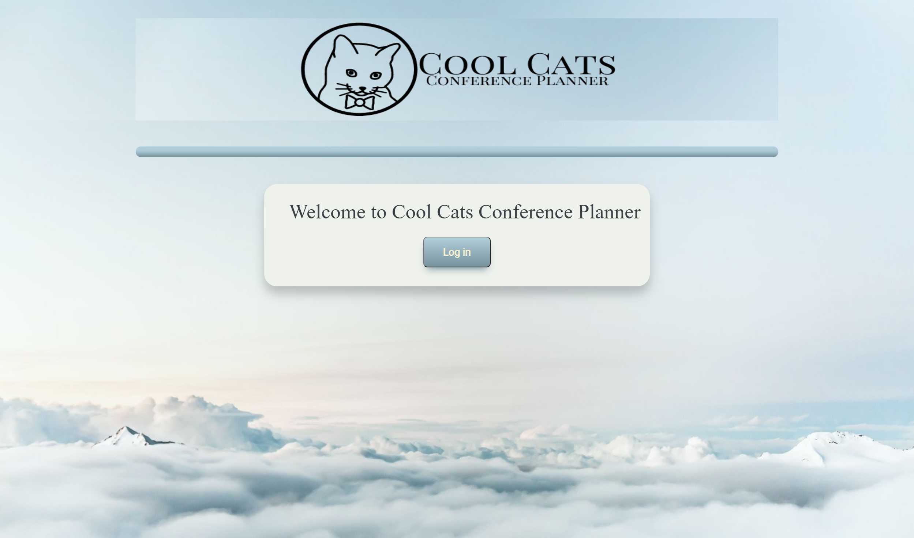
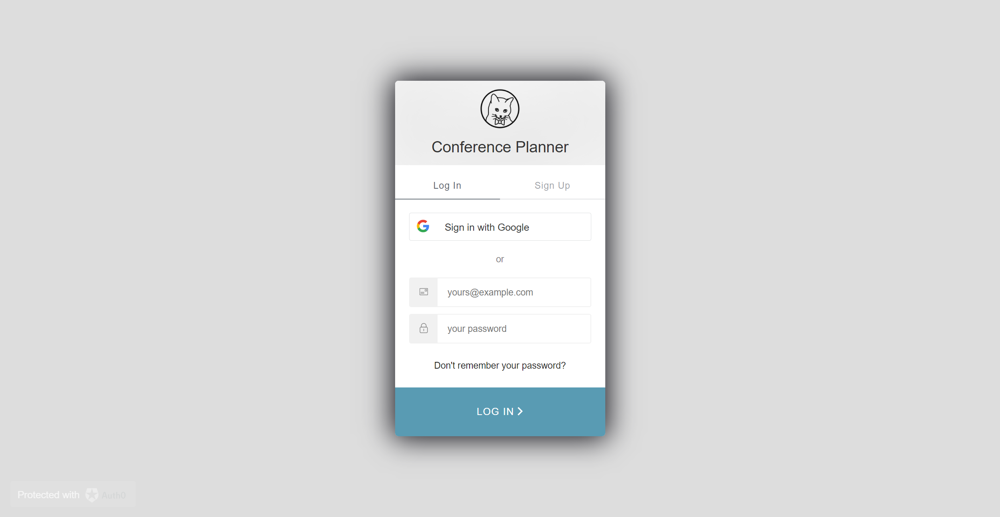
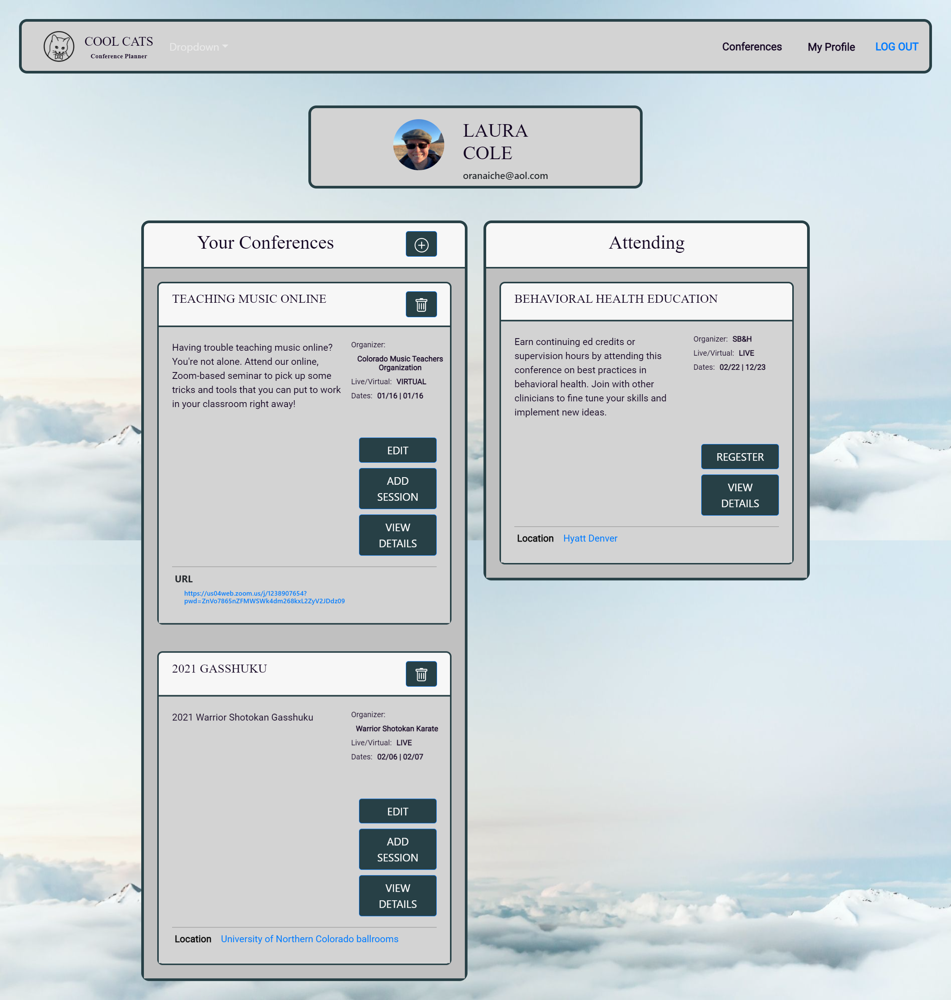
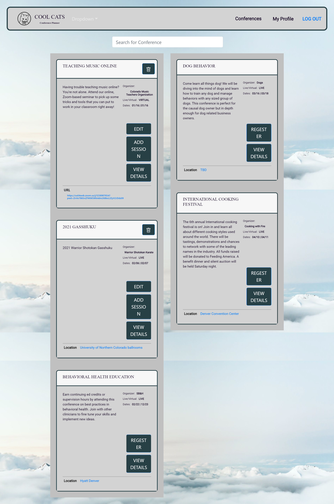
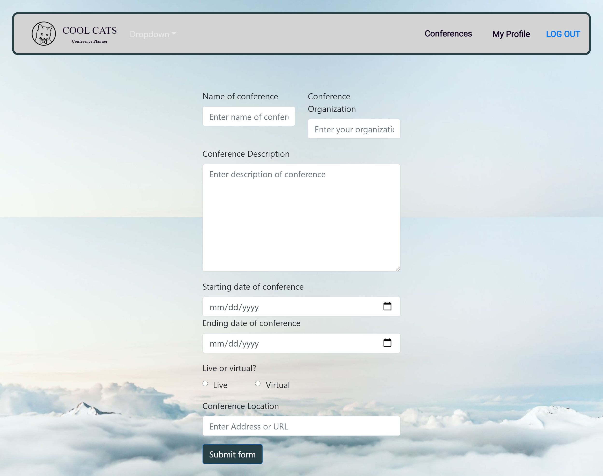
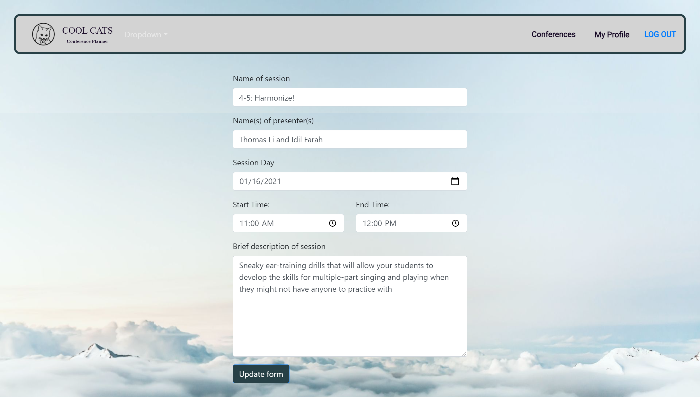

## Table of Contents

* [Description](#description)
* [Links](#links)
* [Screenshots](#screenshots)
* [Installation](#installation)
* [Usage](#usage)
* [Technologies Used](#technologies)
* [Tests](#tests)
* [Collaborators](#collaborators)
* [Contributing](#contributing)
* [Questions](#questions)
* [License](#license)

## Description

Welcome to Cool Cats conference planner, your conference planning home. Gone are the days of important conference details lost in a mess of scrap paper! This application is designed to be a hub for all things conference. Here you can create a conference, keep track of the necessary details, see available conferences and register.

## Links

[Deployed application on Heroku](https://conference-planner.herokuapp.com/)

## Screenshots

Landing page:

Login screen using auth0:

Profile page:

Main conferences page:

"Create conference" page:

"Edit session" page:

Page for a specific conference:

## Installation Instructions

npm i 

## Usage

This application is intended to be used to facilitate the creation and management of conventions, conferences and seminars. Simply open the application on your desired web browser, log in and you are ready to go.  

After logging in, the app will take you to your profile page. Here you can see your basic information and a list of the conferences you created and those conferences you are attending. Clicking the "+" button will allow you to create a new conference. The "details" button allows you to see the the details for that conference, including sessions and speakers.    

The "conferences" page allows you to search existing conferences and register for them. Upon registration, the conference will be added to your profile page.

## Technologies Used

MongoDB, Express.js, React, Node.js, auth0.com

## Tests

npm run test

## Collaborators

This app was built by Anna Battista, Laura Cole, Beni Mahat, Travis Messall, Brenda Miller, and Alec Rewinkel.

## Contributing

We believe code is never finished, welcome your contributions to enhance the applications functionality. Please adhere to the Code of Conduct for the Contributer Covenant, version 2.0, at https://www.contributor-covenant.org/version/2/0/code_of_conduct.html.

## Questions

If you have further questions, you can find us on Github: [Anna Battista](https://github.com/abattista24), [Laura Cole](https://github.com/LauraCole1900), [Beni Mahat](https://github.com/benimahat1291), [Travis Messall](https://github.com/tmessall), [Brenda Miller](https://github.com/millerbee), and [Alec Rewinkel](https://github.com/arewinkl).

## License

.